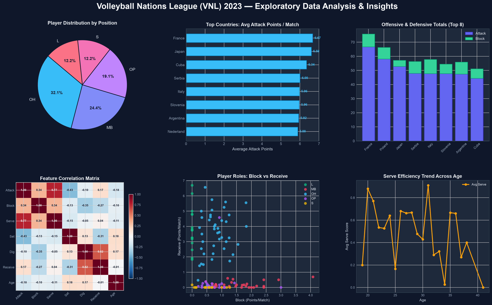
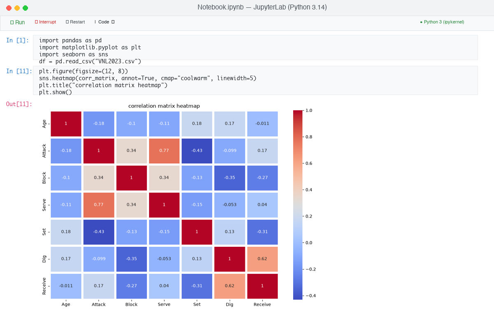
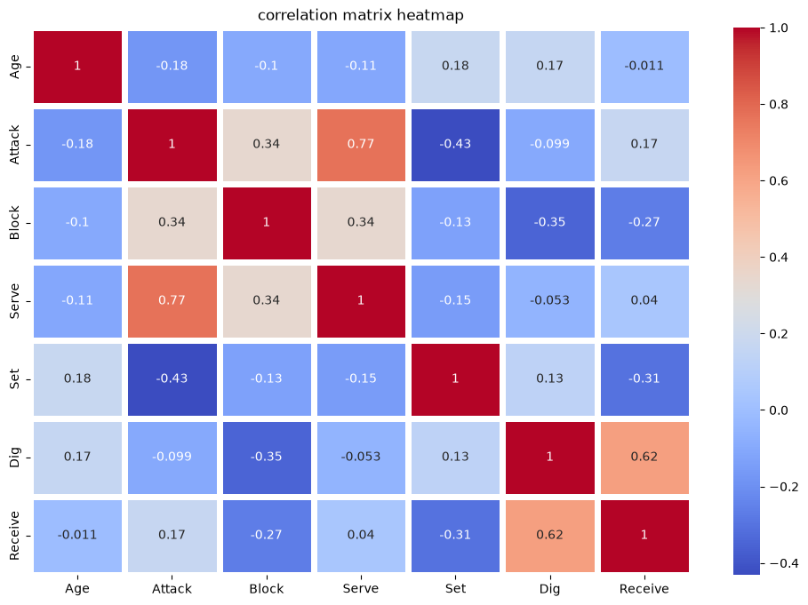
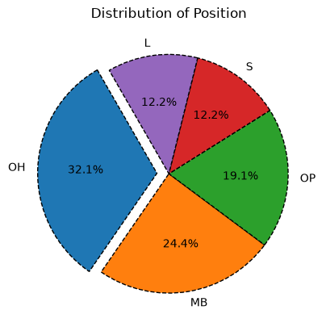
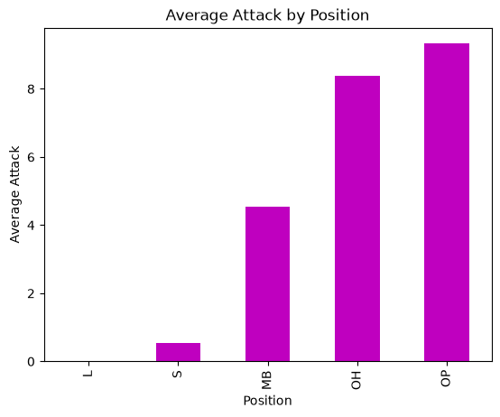
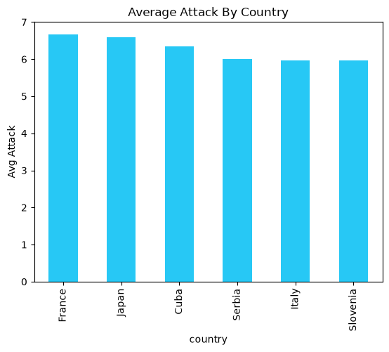
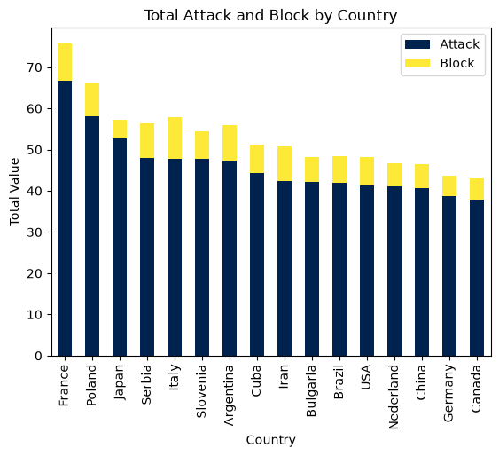
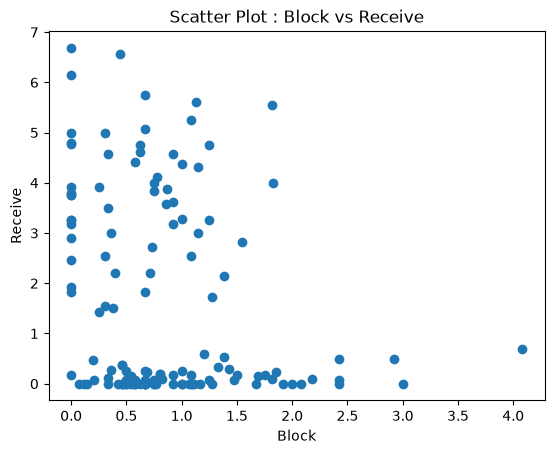
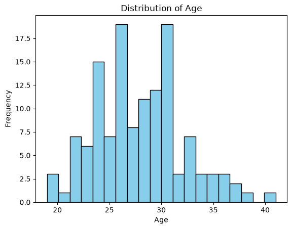
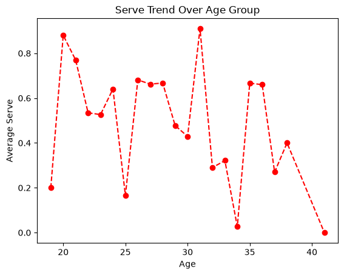

# 🏐 VNL 2023: Volleyball Nations League Player Performance Analysis

[](https://www.python.org/)
[](https://opensource.org/licenses/MIT)
[](https://jupyter.org/)
[](https://pandas.pydata.org/)
[](https://matplotlib.org/)

> **Recommended Repository Name**: `vnl-2023-player-performance-analysis`  
> *(Alternative options: `volleyball-nations-league-eda`, `vnl-analytics-2023`, `analyze-volleyball-data`)*

An in-depth **Exploratory Data Analysis (EDA)** and statistical performance study of elite international volleyball players from the **FIVB Volleyball Nations League (VNL) 2023**. This project investigates individual scoring efficiency, position-based role specializations, team offensive vs. defensive balance, and career age-curve distributions using Python, Pandas, Matplotlib, and Seaborn.

---

## 📸 Project Execution & Analytics Overview

### 1. Comprehensive Analytics Dashboard
Below is the full multi-dimensional analytics dashboard generated directly from the VNL 2023 dataset:



### 2. Live Jupyter Notebook Execution
Original snapshot capturing the notebook execution environment, interactive code cells, and statistical visualizations:



---

## 🎯 Objectives & Research Questions

1. **Role Specialization**: How do statistical contributions (Attacking, Blocking, Setting, Digging, Receiving) differentiate across player positions (`OH`, `OP`, `MB`, `S`, `L`)?
2. **Offensive vs. Defensive Correlations**: What is the correlation between attacking prowess and serving aces, or between digging and serve reception?
3. **National Team Benchmarks**: Which national teams dominate offensive scoring, and how is their scoring distributed between spikes and blocks?
4. **Age Dynamics**: Does player performance (such as serving velocity/consistency) peak at a specific age group, and how wide is the international career age span?

---

## 📊 Dataset Description

The dataset `VNL2023.csv` contains performance metrics for **131 top-tier players** across **16 national teams** competing in the 2023 Men's Volleyball Nations League.

| Field | Type | Description |
| :--- | :--- | :--- |
| `Player` | String | Full name of the volleyball athlete |
| `Country` | String | National team representation (16 nations: Japan, Italy, Poland, USA, Brazil, etc.) |
| `Age` | Integer | Player age (range: 19 – 41 years, mean: 27.8) |
| `Attack` | Float | Average attack points (kills/spikes) scored per match |
| `Block` | Float | Average kill blocks scored per match |
| `Serve` | Float | Average service aces scored per match |
| `Set` | Float | Average successful setting assists per match |
| `Dig` | Float | Average defensive digs per match |
| `Receive` | Float | Average successful service receptions per match |
| `Position` | String | Court position: `OH` (Outside Hitter), `OP` (Opposite), `MB` (Middle Blocker), `S` (Setter), `L` (Libero) |

---

## 🔍 Key Findings & Visual Insights

### 1. Correlation Matrix Heatmap
Evaluating relationships across all numerical metrics:



- **Strongest Positive Correlation (\(r = 0.77\))**: **Attack vs. Serve**. High-volume attackers (Outside Hitters and Opposites) also bear the burden of aggressive jump serving to break opponent reception.
- **Defensive Synergy (\(r = 0.62\))**: **Dig vs. Receive**. Players with elite reception statistics also record the highest dig volumes.
- **Role Inversion (\(r = -0.43\))**: **Attack vs. Set**. Setters focus purely on ball distribution, while primary attackers register near-zero setting metrics.

---

### 2. Positional Composition & Role Distribution
Analysis of player roster allocations across international squads:

| Position Distribution | Average Attack by Position |
| :---: | :---: |
|  |  |

- **Roster Allocation**: Outside Hitters (`OH`) comprise **32.1%** of the recorded roster, followed by Middle Blockers (`MB`) at **24.4%**, Opposites (`OP`) at **19.1%**, and Setters/Liberos at **12.2%** each.
- **Attacking Contribution**: Opposite Hitters lead the tournament in per-match attack volume (~10.5 pts/match), followed closely by Outside Hitters (~7.2 pts/match).

---

### 3. Country-Level Offensive & Defensive Output
Comparison of scoring potency among leading volleyball nations:

| Top Countries by Average Attack | Total Attack & Block by Country |
| :---: | :---: |
|  |  |

- **Top Attack Averages**: France (\(6.67\)), Japan (\(6.59\)), Cuba (\(6.34\)), Serbia (\(6.00\)), and Italy (\(5.96\)) rank as the most efficient attacking units per player.
- **Net Defense vs. Attack Volume**: Teams like Poland, France, and Japan show superior balance between attack totals and blocking points.

---

### 4. Player Specialization: Blocking vs. Reception
Mapping defensive profiles by tactical position:



- **Liberos (`L`) & Outside Hitters (`OH`)**: Clustered on the vertical axis with high reception numbers and near-zero blocking responsibility.
- **Middle Blockers (`MB`)**: Clustered along the horizontal axis with peak block numbers (up to 4.08 blocks/match) and zero receive duties.

---

### 5. Demographics & Serve Performance by Age
Exploring how age correlates with elite international performance:

| Age Distribution | Serve Efficiency Across Age Groups |
| :---: | :---: |
|  |  |

- **Age Spectrum**: The player age distribution peaks symmetrically around **26–28 years**, with experienced veterans contributing up to age 41.
- **Serving Efficiency**: Highest average serving scores are observed in the early 20s (explosive jump servers) and early 30s (experienced, tactical placement servers).

---

## 📂 Repository Structure

```plaintext
vnl-2023-player-performance-analysis/
├── assets/                               # Visual assets generated from project execution
│   ├── vnl_analytics_overview.png        # Master 6-panel analytics dashboard
│   ├── notebook_execution_screenshot.png # Jupyter notebook execution screenshot
│   ├── correlation_matrix_heatmap.png    # Metric correlation heatmap
│   ├── position_distribution_pie.png     # Position breakdown pie chart
│   ├── avg_attack_by_country_bar.png     # Country attack rankings
│   ├── total_attack_block_stacked_bar.png# Attack & block stacked totals
│   ├── avg_attack_by_position_bar.png    # Position attacking output
│   ├── block_vs_receive_scatter.png      # Role specialization scatter plot
│   ├── serve_distribution_boxplot.png    # Serve distribution & outliers
│   ├── age_distribution_histogram.png    # Player age distribution
│   └── serve_trend_by_age_line.png       # Serve trend by age group
├── Notebook.ipynb                        # Complete data analysis workflow & visualizations
├── VNL2023.csv                           # Raw VNL 2023 tournament dataset
├── requirements.txt                      # Python dependencies list
└── README.md                             # Project documentation and summary
```

---

## 🚀 Getting Started

### Prerequisites
Make sure you have **Python 3.10+** installed on your system.

### 1. Clone the Repository
```bash
git clone https://github.com/your-username/vnl-2023-player-performance-analysis.git
cd vnl-2023-player-performance-analysis
```

### 2. Create and Activate a Virtual Environment
```bash
# macOS/Linux
python3 -m venv venv
source venv/bin/activate

# Windows
python -m venv venv
venv\Scripts\activate
```

### 3. Install Dependencies
```bash
pip install -r requirements.txt
```

### 4. Launch Jupyter Notebook
```bash
jupyter lab
# or
jupyter notebook
```
Open [`Notebook.ipynb`](Notebook.ipynb) to inspect or re-run the entire data analysis pipeline.

---

## 🛠️ Tech Stack

- **Language**: Python 3.10+
- **Data Manipulation**: [Pandas](https://pandas.pydata.org/), [NumPy](https://numpy.org/)
- **Data Visualization**: [Matplotlib](https://matplotlib.org/), [Seaborn](https://seaborn.pydata.org/)
- **Interactive Environment**: [JupyterLab / Notebook](https://jupyter.org/)
- **Image Processing**: [Pillow (PIL)](https://python-pillow.org/)

---

## 💡 Suggested Repository Names

When publishing this project on GitHub or GitLab, here are recommended naming conventions:

1. **`vnl-2023-player-performance-analysis`** *(Recommended)* — Clean, descriptive, and highlights both the tournament and analytical focus.
2. **`volleyball-nations-league-eda`** — Emphasizes the exploratory data analysis nature.
3. **`vnl-analytics-2023`** — Compact and memorable.
4. **`analyze-volleyball-data`** — Direct match with the current project directory.

---

## 📄 License

This project is licensed under the [MIT License](LICENSE). Feel free to use and adapt this analysis for research or educational purposes.
